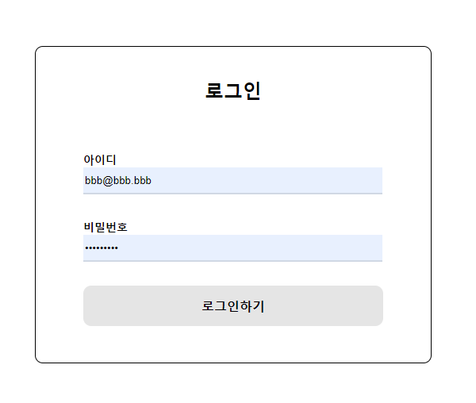

# Project onBoarding

## Tech Stack

- React.js
- TypeScript
- Styled-components
- axios
- MSW
- React-query

## 구현 내용

### MSW를 사용하여 가상으로 로그인, 회원가입 API를 생성

```typescript
// src/mock/handlers.ts
import { rest } from 'msw';

interface FormValue {
  id: string;
  password: string;
}

export const handlers = [
  // 로그인
  rest.post<FormValue>('/login', async (req, res, ctx) => {
    if (!req.body.id) {
      return res(
        ctx.status(401),
        ctx.json({
          message: '아이디가 입력되지 않았습니다.',
        }),
      );
    }
    if (!req.body.password) {
      ctx.status(402),
        ctx.json({
          message: '비밀번호가 입력되지 않았습니다.',
        });
    }
    return res(
      ctx.status(200),
      ctx.json({
        id: req.body.id,
        password: req.body.password,
      }),
    );
  }),
  // 회원가입
  rest.post<FormValue>('/join', async (req, res, ctx) => {
    if (!req.body.id) {
      return res(
        ctx.status(401),
        ctx.json({
          message: '아이디가 입력되지 않았습니다.',
        }),
      );
    }
    if (!req.body.password) {
      ctx.status(402),
        ctx.json({
          message: '비밀번호가 입력되지 않았습니다.',
        });
    }
    return res(
      ctx.status(200),
      ctx.json({
        id: req.body.id,
        password: req.body.password,
      }),
    );
  }),
];
```

```typescript
// src/mock/browser.ts
import { setupWorker } from 'msw';
import { handlers } from './handlers';

export const worker = setupWorker(...handlers);
```

### Styled-components + React-hook-form을 활용한 폼 UI 구현

<brr><br>

<div align='center'>

</div>
<br><br>

### 로그인으로 얻은 아이디, 비밀번호 React-query로 관리
